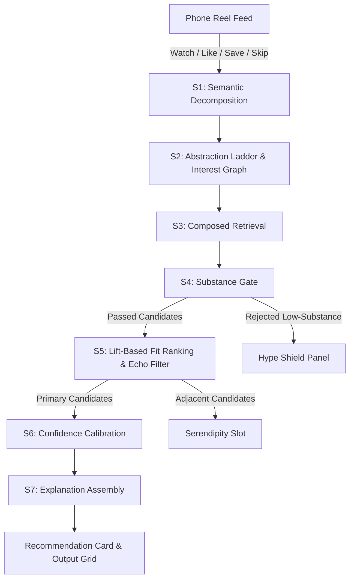

# ⚡ SIGNAL — Reel Intelligence Agent

> **An AI Agent that decodes what a student's scrolling *actually means* and redirects the next 60 seconds toward something worth their time.**

[](https://render.com/deploy)
[](https://github.com/Mukkandi-Sridhar/PromptWarsHackothan)
[](#)

---

## 🎯 0. What We Built & Why It Wins

**The Problem:** Students burn hours on short-form video feeds (Reels, Shorts, TikTok). Most content isn't harmful, but compounding watch time on surface memes leaves them with zero skill progression.

**The Trap in Existing Systems:**
A student watches a Java meme, a software engineer lifestyle reel, a coding interview joke, and a laptop comparison.
- **Weak Systems (TF-IDF / Surface Recommendation):** See the keyword `"Java"` and serve *another Java meme*. This traps the user in a low-value echo loop.
- **SIGNAL (Reel Intelligence Agent):** Analyzes the *latent intent* across watched reels. It realizes the student is an **aspirational software engineer anxious about placements**, blocks low-lift memes using an **Abstraction Ladder**, and serves a bridge reel: *"Your NullPointerException isn't a bug, it's a design decision"* (Java, Intermediate, High Lift).

---

## 🏗️ 1. System Architecture (7-Stage Agent Pipeline)



### 🧠 Stage Breakdown
1. **S1 · Semantic Decomposition**: Extracts surface topic, latent concept, domain signal, intent, affective tone, and sophistication level for every watched reel.
2. **S2 · Interest Graph Synthesis**: Builds a 3-tier Abstraction Ladder (`L1 Surface Tokens` → `L2 Skill Domains` → `L3 Identity & Goals`) with convergence scoring.
3. **S3 · Candidate Retrieval**: Formulates vector & hybrid queries across candidate library.
4. **S4 · Substance Gate**: Evaluates rhetoric quality (0–100 score). Flags outcome promises without mechanism, tool listicles without problems, and recycled memes.
5. **S5 · Fit Ranking & Distinctive Echo Filter**:
   - Computes Document Frequency (DF < 0.20) on surface tokens.
   - Blocks surface echoes *unless* the reel delivers real lift (substance ≥ 70, higher difficulty, or <60% concept overlap).
   - Separates adjacent non-overlapping candidates into the **Serendipity Exploration Slot**.
6. **S6 · Confidence Calibration**: Evaluates graph convergence (`High` ≥3 distinct signals, `Medium` 2 signals, `Low` widening scope).
7. **S7 · Explanation Assembly**: Synthesizes 8-line structured output block with character typing animation and evidence citations.

---

## 🚀 2. Quick Deploy on Render (Single-Service Fullstack)

This repository is pre-configured to deploy on **Render** as a single web service that runs FastAPI and serves the compiled React Vite frontend assets from a single port.

### Option A: 1-Click Render Blueprint (Recommended)
1. Fork or push this repository to GitHub.
2. Click the **Deploy to Render** button above or connect your repository in [Render Dashboard](https://dashboard.render.com/).
3. Render automatically reads `render.yaml` and starts building!
4. Add your `OPENAI_API_KEY` under Environment Variables in Render.

### Option B: Manual Render Web Service Setup
- **Environment**: `Python 3.10+`
- **Build Command**:
  ```bash
  pip install -r signal/backend/requirements.txt && cd signal/frontend && npm install && npm run build
  ```
- **Start Command**:
  ```bash
  cd signal && uvicorn backend.main:app --host 0.0.0.0 --port $PORT
  ```
- **Environment Variables**:
  - `LLM_PROVIDER`: `openai`
  - `OPENAI_API_KEY`: `sk-...`
  - `OPENAI_MODEL`: `gpt-4o-mini`
  - `OPENAI_MODEL_STRONG`: `gpt-4o`

---

## 💻 3. Local Quickstart (1 Command)

Run everything locally with a single script:

```bash
git clone https://github.com/Mukkandi-Sridhar/PromptWarsHackothan.git
cd PromptWarsHackothan/signal
./run.sh
```

`run.sh` will:
1. Create virtualenv `.venv` and install backend dependencies.
2. Seed SQLite database `backend/data/signal.db`.
3. Precompute seed reel decompositions and candidate substance scores.
4. Install frontend npm dependencies.
5. Launch FastAPI backend on `http://localhost:8000` and Vite dev server on `http://localhost:5173`.

---

## 🎤 4. Hackathon Judge Walkthrough Script (2 Minutes)

| Time | Action | What to Say |
|---|---|---|
| **0:00** | **Shallow Mode Baseline** | *"Watch reels 1-4 in Shallow Mode. Notice how keyword matching returns another Java meme and an AI tools listicle. It's relevant, but worthless."* |
| **0:30** | **Toggle to Agent Mode** | *"Switch to Agent Mode. Watch the Abstraction Ladder climb L1 -> L3. Four reels converge on one identity: someone becoming a software engineer, anxious about placements."* |
| **0:50** | **Point at Hype Shield** | *"Look at the Hype Shield. The agent found the '10 AI Tools' listicle too, but threw it out because it promises outcomes without teaching mechanism."* |
| **1:05** | **Recommendation Lands** | *"The recommendation stays on Java: 'Your NullPointerException isn't a bug'. It blocked 6 other Java reels, but kept this one because it delivers actual conceptual lift."* |
| **1:20** | **Zero-Signal Reel** | *"Swipe to reel 5 (street food). Notice the notice: 'no signal from current reel · graph unchanged'. The agent discriminates instead of reacting to everything on screen."* |
| **1:35** | **Serendipity & Offline Badge** | *"Check the 'ALSO WORTH 60 SECONDS' serendipity pick for cybersecurity. And if the API drops, the honest header badge reports 'offline · reason' instead of silently failing."* |

---

## 🧪 5. Automated Verification & Test Suite

Run unit tests verifying agent correctness, filter logic, and offline parity:

```bash
cd signal
source .venv/bin/activate
python -m pytest backend/tests/test_agent.py -v
```

```text
============================== 9 passed in 0.12s ===============================
✓ test_no_shallow_echo PASSED
✓ test_bridge_wins_over_domain_jump PASSED
✓ test_hype_rejected PASSED
✓ test_l3_convergence PASSED
✓ test_negative_signal PASSED
✓ test_weak_signal_ignored PASSED
✓ test_low_confidence_widens PASSED
✓ test_output_format PASSED
✓ test_offline_parity PASSED
```

---

## 🎨 6. Design System & Aesthetics

- **Color Palette**: Dark mode (`#071319`), Amber (`--signal` `#FFB020`), Cyan (`--probe` `#4FD1D9`), Coral (`--reject` `#FF6B5A`).
- **Strict Color Budget**: ≤ 3 amber elements, ≤ 2 cyan elements across the screen.
- **Zero-Border Discipline**: Containers only get borders. All chips, pills, and nodes use filled backgrounds with 0 borders.
- **Typography Hierarchy**: Space Grotesk 26px for recommendation titles, Inter for body/chips, JetBrains Mono for output grid and execution logs.
- **Motion Layer**: Real SSE-driven pacing (0 spinners), candidate stream overlay, word-by-word reveal, and character typing caret.

---

## 📁 7. Repository Structure

```
PromptWarsHackothan/
├── render.yaml               # Render 1-Click Deployment Blueprint
├── build_render.sh           # Single-command build script for Render
├── .gitignore
├── README.md
└── signal/
    ├── run.sh                # Local 1-command startup script
    ├── backend/
    │   ├── main.py           # FastAPI app & static file mount
    │   ├── db.py             # SQLite WAL connection
    │   ├── config.py         # Config & environment settings
    │   ├── precompute.py     # Batched precomputation script
    │   ├── agent/            # S1-S7 Pipeline Stages
    │   │   ├── s1_decompose.py
    │   │   ├── s2_interest_graph.py
    │   │   ├── s3_retrieve.py
    │   │   ├── s4_substance_gate.py
    │   │   ├── s5_fit_rank.py
    │   │   ├── s6_calibrate.py
    │   │   └── s7_explain.py
    │   ├── llm/              # AsyncOpenAI client & fallback
    │   └── tests/            # Pytest test suite
    └── frontend/
        ├── index.html
        ├── package.json
        ├── vite.config.ts
        └── src/
            ├── App.tsx       # Main Shell & Choreography
            ├── store.ts      # Zustand Store
            ├── theme.css     # Design Tokens & Animations
            └── components/   # PhoneFeed, AbstractionLadder, HypeShield, RecommendationCard, MetricsStrip
```

---

## 📄 License

Distributed under the MIT License. See `LICENSE` for details.
